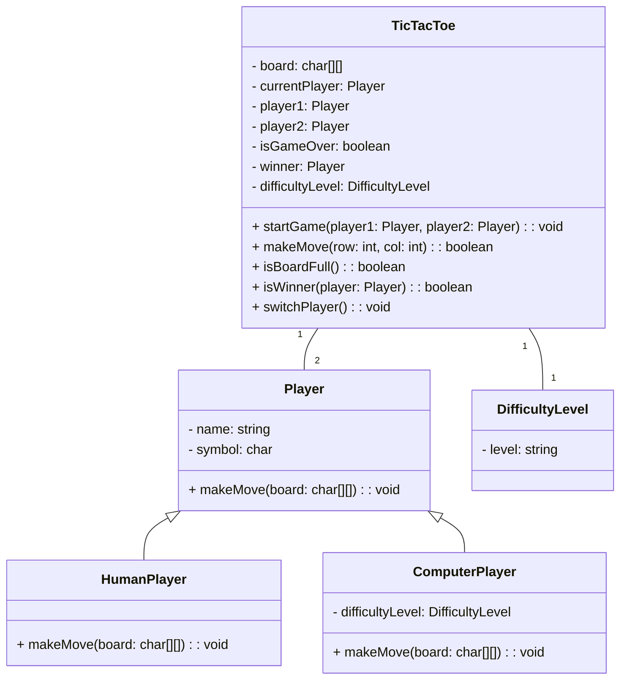

```mermaid
classDiagram
  class TicTacToe {
    - board: char[][]
    - currentPlayer: Player
    - player1: Player
    - player2: Player
    - isGameOver: boolean
    - winner: Player
    - difficultyLevel: DifficultyLevel
    + startGame(player1: Player, player2: Player): void
    + makeMove(row: int, col: int): boolean
    + isBoardFull(): boolean
    + isWinner(player: Player): boolean
    + switchPlayer(): void
  }

  class Player {
    - name: string
    - symbol: char
    + makeMove(board: char[][]): void
  }

  class HumanPlayer {
    + makeMove(board: char[][]): void
  }

  class ComputerPlayer {
    - difficultyLevel: DifficultyLevel
    + makeMove(board: char[][]): void
  }

  class DifficultyLevel {
    - level: string
  }

  TicTacToe "1" -- "2" Player
  TicTacToe "1" -- "1" DifficultyLevel
  Player <|-- HumanPlayer
  Player <|-- ComputerPlayer
```
